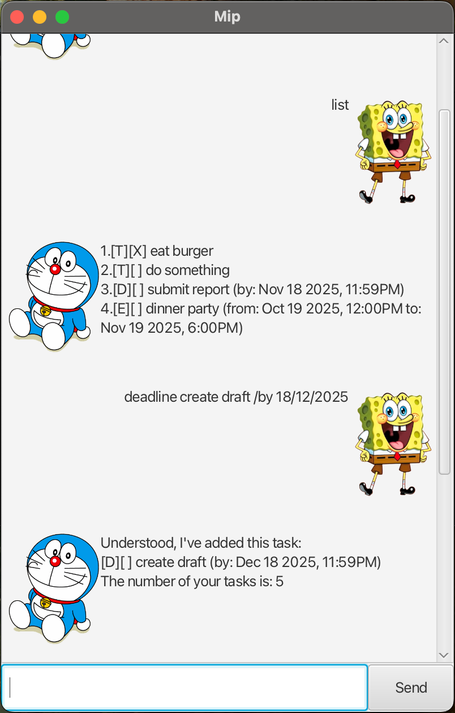

# Mip User Guide

Mip is a simple chatbot that helps you keep track of your tasks.  
You can add, list, search, and manage tasks through natural text-like commands.  
Your tasks are automatically saved between sessions in `data/tasks.txt`.

## Exiting the chatbot: `bye`

Ends the session.

**Format:** `bye`  
**Example:**

    > bye
    Goodbye! Mip WILL see you again.

## Listing tasks: `list`

Shows all tasks currently stored.

**Format:** `list`  
**Example:**

    > list
    1. [T][ ] Read book
    2. [D][ ] Submit report (by: Sunday 11:59pm)

## Adding a todo task: `todo`

Adds a task with only a description.

**Format:** `todo DESCRIPTION`  
**Example:**

    > todo Buy groceries
    Understood, I've added this task:
    [T][ ] Buy groceries
    The number of your tasks is: 1

## Adding a deadline task: `deadline`

Adds a task that must be done by a specific time or date.

**Format:** `deadline DESCRIPTION /by DEADLINE`

- If `DEADLINE` is in the format `d/M/yyyy HHmm` (e.g., `2/12/2019 1800`), it will be parsed and displayed as `MMM dd yyyy, h:mma` (e.g., `Dec 02 2019, 6:00PM`).
- If `DEADLINE` is in the format `d/M/yyyy` (e.g., `2/12/2019`), it will default to `11:59 PM`.
- If the input cannot be parsed, Mip will display it as entered.

**Examples:**

    > deadline Submit report /by 2/12/2019 1800
    Understood, I've added this task:
    [D][ ] Submit report (by: Dec 02 2019, 6:00PM)
    The number of your tasks is: 2

    > deadline Finish homework /by 2/12/2019
    Understood, I've added this task:
    [D][ ] Finish homework (by: Dec 02 2019, 11:59PM)
    The number of your tasks is: 3

## Adding an event task: `event`

Adds a task that happens within a time range.

**Format:** `event DESCRIPTION /from START /to END`

- Both `START` and `END` can be parsed in the same `d/M/yyyy HHmm` or `d/M/yyyy` formats.
- If `START` is a full date-time (`d/M/yyyy HHmm`), it will display as `MMM dd yyyy, h:mma`.
- If `START` is only a date (`d/M/yyyy`), it defaults to **start of the day (00:00)**.
- If `END` is a full date-time, it will display nicely.
- If `END` is only a date, it defaults to **end of the day (23:59)**.
- If parsing fails, Mip will display the times exactly as entered.

**Examples:**

    > event Team meeting /from 2/12/2019 1400 /to 2/12/2019 1600
    Understood, I've added this task:
    [E][ ] Team meeting (from: Dec 02 2019, 2:00PM to: Dec 02 2019, 4:00PM)
    The number of your tasks is: 4

    > event Party /from 2/12/2019 /to 3/12/2019
    Understood, I've added this task:
    [E][ ] Party (from: Dec 02 2019, 12:00AM to: Dec 03 2019, 11:59PM)
    The number of your tasks is: 5

## Marking a task as done: `mark`

Marks the specified task as done.

**Format:** `mark INDEX`  
**Example:**

    > mark 1
    Understood, I've marked this task as done
    [T][X] Buy groceries

## Unmarking a task: `unmark`

Marks the specified task as **not** done.

**Format:** `unmark INDEX`  
**Example:**

    > unmark 1
    Understood, I've unmarked this task
    [T][ ] Buy groceries

## Deleting a task: `delete`

Deletes the specified task.

**Format:** `delete INDEX`  
**Example:**

    > delete 2
    Understood, I've deleted this task:
    [D][ ] Submit report (by: Dec 02 2019, 6:00PM)

## Finding tasks: `find`

Searches for tasks containing the given keyword.

**Format:** `find KEYWORD`  
**Example:**

    > find report
    1. [D][ ] Submit report (by: Dec 02 2019, 6:00PM)

## Handling invalid input

- If you enter an empty command, Mip will remind you to type something.
- If you type an invalid command, Mip will respond with:

    > unknown command
    I have no idea what you are talking about...

---

## Data Storage

- All tasks are stored automatically in the file `data/tasks.txt`.
- If the folder or file does not exist, Mip will create them on first run.
- This ensures your task list persists across multiple sessions.

---

## Tips

- Commands are **case-sensitive**. Use lower-case keywords like `todo`, `deadline`, `event`.
- Indexes (for `mark`, `unmark`, `delete`) follow the task list numbering shown by the `list` command.
- Keep commands short and precise for best results.